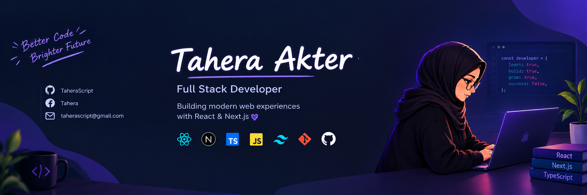

 
   
  

  
   
  
   
  

📍 Dhaka, Bangladesh  
 •  📧 taherascript@gmail.com

# 💫 About Me
I'm an aspiring full-stack developer passionate about building modern web experiences. 
Currently learning, building projects, and growing my skills step by step.

🔭 Building modern web projects with React & Next.js 🌱 Currently learning full-stack development 💻 Exploring TypeScript, Next.js & backend technologies 🤝 Open to collaborating on web development projects 💬 Ask me about JavaScript, React & Next.js 🎯 Working toward becoming a professional full-stack developer 🌍 Future goal: Remote development & open-source collaboration   📧 Email : taherascript@gmail.com

<h1>🔭 Currently</h1>
<ul>
  <li>🚀 I'm exploring Next.js</li>
  <li> 🛠️ I'm working on a project,which title is Fitlog--Workout Library (https://assignment-6-fitlog-eight.vercel.app/)</li>
  <li>📚 I'm learning TypeScript</li>
  <li> 🤝 I'm open to collaborating on frontend / full-stack projects</li>
</ul>

## Let's Connect 🤝

|  |  |
|:-:|:-:|
# 💻 Tech Stack:

These are some of the major technologies that I use or have worked on in the past:

**Programming Languages**

|  |  |  |  |  |
|:-:|:-:|:-:|:-:|:-:|

**Libraries and Frameworks**

|  |  |  |  |  |
|:-:|:-:|:-:|:-:|:-:|

**Tools**

|  |  |  |  |  |  |  |
|:-:|:-:|:-:|:-:|:-:|:-:|:-:|

# 📊 GitHub Stats:
# 📊 GitHub Stats:
 
 

